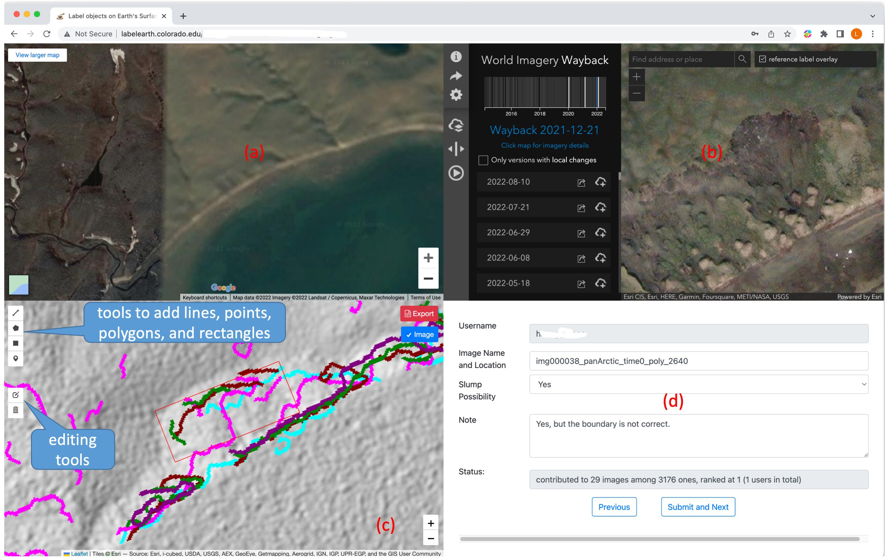

# labelEarth
A web-based tool for labeling objects on Earth Surface (A [demo](https://youtu.be/ly7QRXTiBaQ) on Youtube).

<figure>

<figcaption align = "center"><b>The crowdsourcing system integrates google satellite imagery (a), ESRI World Imagery Wayback (b), composited imagery derived from ArcticDEM (c), and a form (d) into a single window. In panel (c), users can add, edit, or remove lines, points, polygons, and rectangles using tools on the left, allowing users to add/edit/remove the bounding box of an object if it is a false negative/inaccurate result/false positive. Users can also hide the composited imagery by using the checkbox on the upper right. In panel (d), users can input the possibility (Yes, high, medium, low, and No) of an RTS and also comments. Users can use mouse (middle scroll) to zoom in/out in panel (c). </b></figcaption>
</figure>


### TODO
- [x] remove the old png after moving to a new location.
- [x] codes for "previous" 
- [x] Save drawn polygons if available  
- [x] Add total number and image num
- [ ] screenshot of the two map iFrame and POST to server. 
- [x] A checkbox to hide the image (only show ESRI base map). 
- [x] Make the checkbox easier to use and see.
- [ ] SubmitAndNext in infoFormEdit failed "TypeError: Failed to fetch". On my mac, it always can save the record to database, but on tesia, sometime yes, sometimes no.
- [ ] After click submit, how to wait until the record is saved to database?

[//]: # (- [x] Venus)


### Citation
If this repository is useful for your projects, please consider citing our papers:

```
@article{huang2023identifying,
  title={Identifying active retrogressive thaw slumps from ArcticDEM},
  author={Huang, Lingcao and Willis, Michael J and Li, Guiye and Lantz, Trevor C and Schaefer, Kevin and Wig, Elizabeth and Cao, Guofeng and Tiampo, Kristy F},
  journal={ISPRS Journal of Photogrammetry and Remote Sensing},
  volume={205},
  pages={301--316},
  year={2023},
  publisher={Elsevier}
}
```
